# Склад 15 (Клеверенс) + 1С:Управление торговлей 11

## Что развёрнуто

| Компонент ||
|---|---|
| 1С:Предприятие (платформа, учебная версия) |
| Конфигурация «Управление торговлей», ред. 11 (демо-база) |
| Mobile SMARTS: Склад 15, редакция «Минимум» (сервер) |
| Веб-панель Склада 15 |
| Мобильный клиент Склада 15 (Android) |
| Устройство эмулятор Android (AVD, Pixel) без физического сканера |

Режим работы Склада 15: **демо** (без лицензии)

## Как развёрнуто

1. Установлена конфигурация УТ 11.5.27.93, создана демо-база.
2. Установщиком `WH15.InstallWizard` создана база «Склад 15, Минимум» на локальном сервере Mobile SMARTS, в мастере выбрана учётная система «1С:Предприятие 8».
3. В 1С подключена главная обработка Клеверенса (мастер «1C Exchange Setup»). Результат — экран «Setup complete».
4. Включён обмен через Интернет (шлюз Клеверенса).
5. Клиент Склада 15 установлен на Android-эмулятор из APK и подключён к серверу со страницы «Подключить устройство» веб-панели.

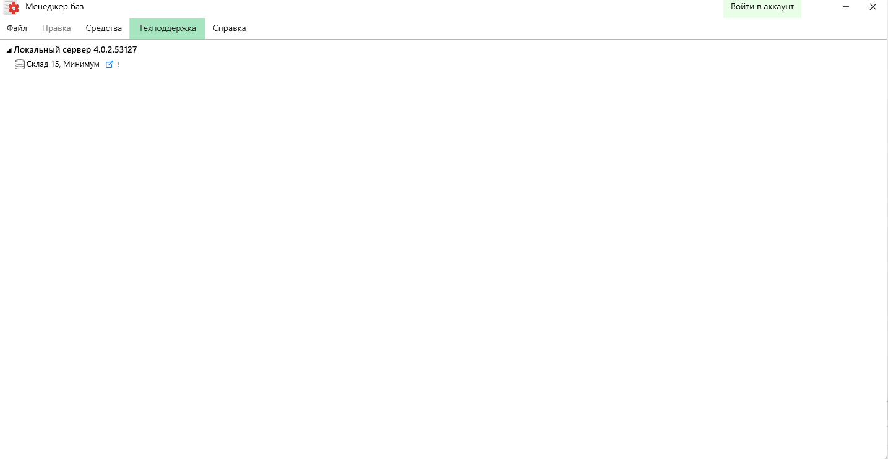

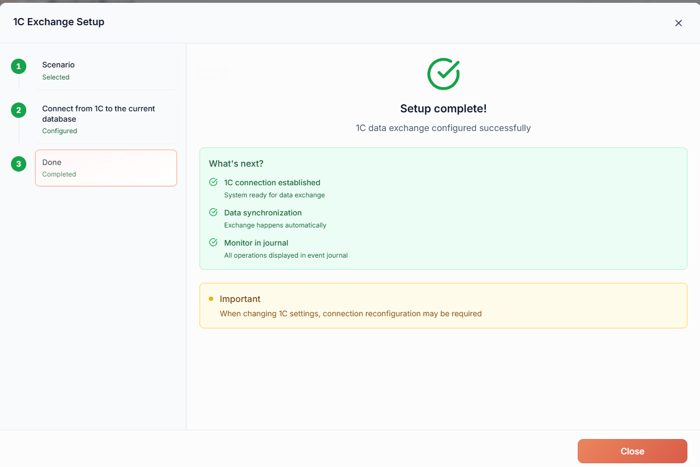

## Проверенный сценарий: приёмка по заказу поставщика

1. **Справочники.** В 1С: «Клеверенс» → «Обмен справочниками» → «Выгрузить все справочники». В клиенте (Browse Directories → Products) появилась номенклатура из демо-базы УТ.

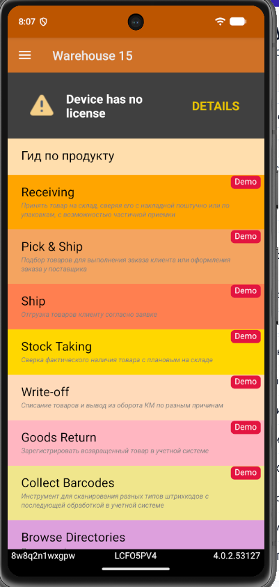

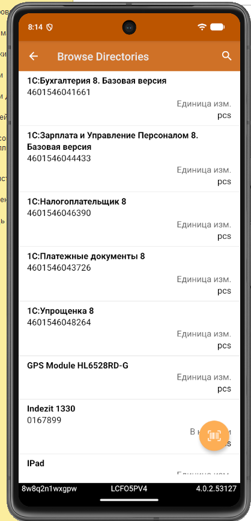
2. **Заказ поставщику.** В УТ создан заказ ЧП00-000001 на 3 товара (кофе-машина «Универсал» — 2, мясорубка MOULINEX A 15 — 5, соковыжималка BINATONE JE 102 — 1), заказ проведён, статус «Подтверждён».

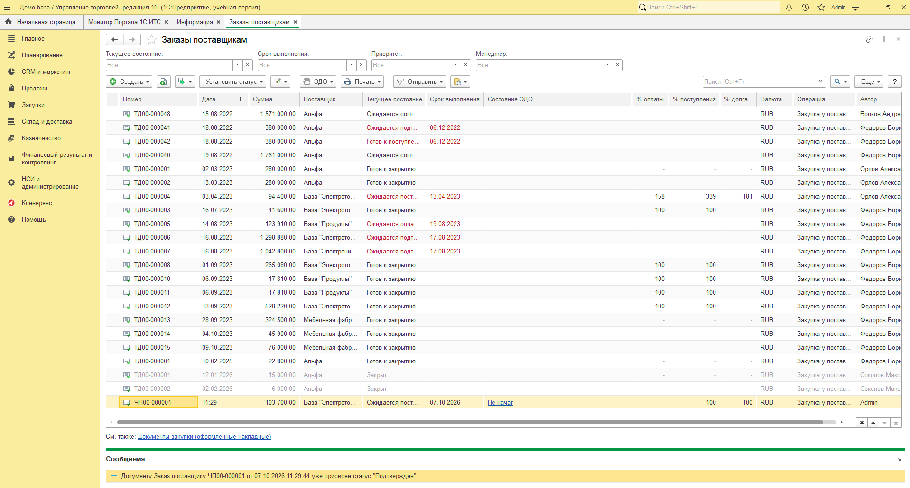
3. **Выгрузка на ТСД.** «Клеверенс» → «Обмен документами» → отмечен заказ → «Выгрузить из 1С». Сообщение: «На ТСД успешно выгружено 1 документов». В панели Склада 15 документ появился в разделе «Приёмка».

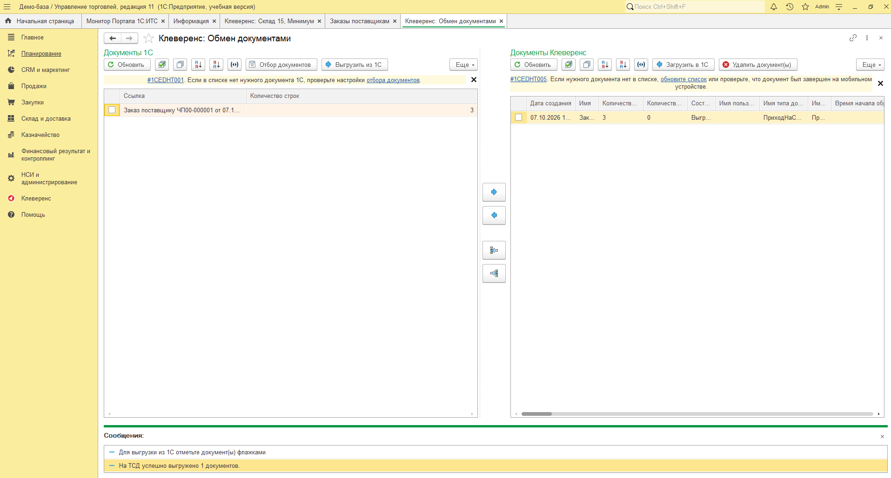

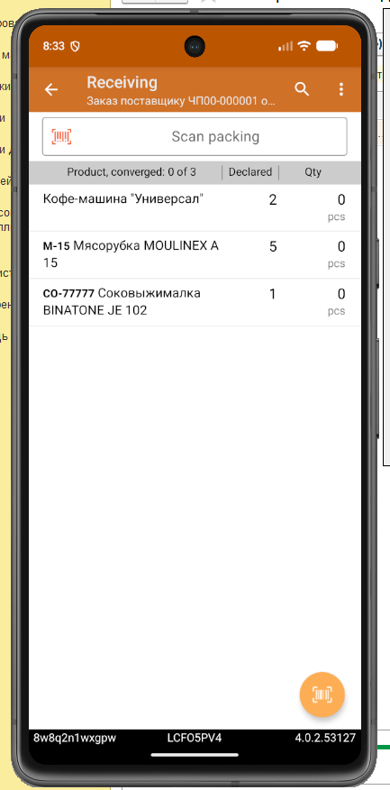
4. **Приёмка на терминале.** В клиенте «Receiving» открыт заказ, принято 2 / 5 / 1, итог «converged: 3 of 3», документ завершён (статус «Завершён» в панели).

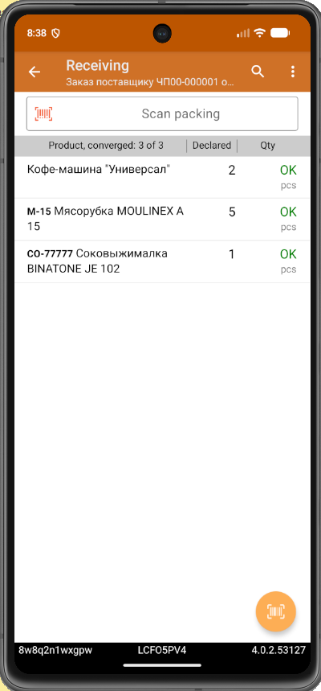

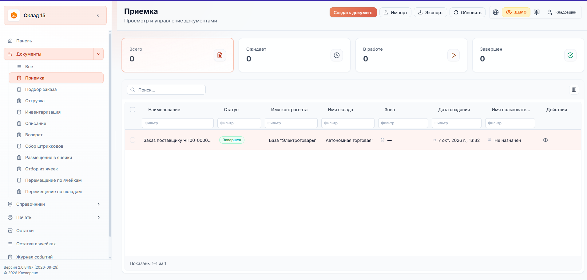
5. **Возврат в 1С.** В «Обмене документами» документ из правой таблицы загружен кнопкой «Загрузить в 1С» в режиме «новый». В УТ создан документ «Приобретение товаров и услуг» на основании заказа с теми же 3 строками, документ проведён.

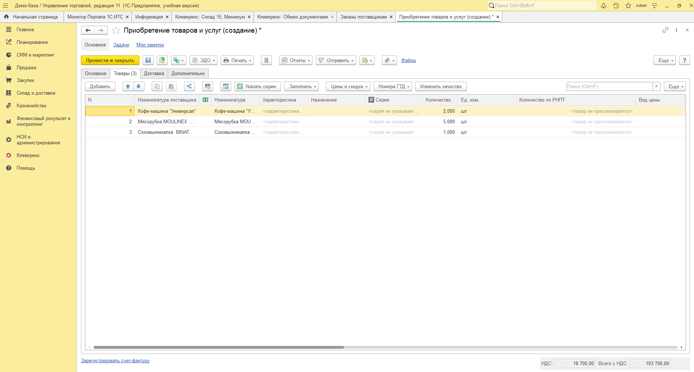

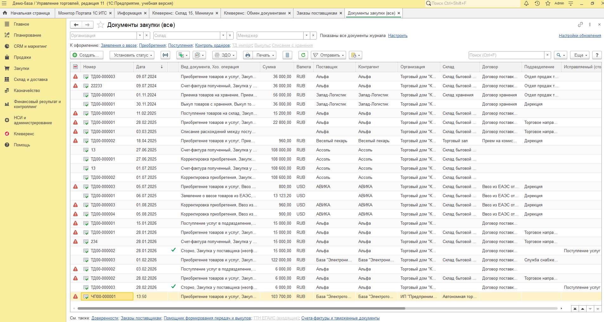

### Хронология по журналу событий Склада 15

| Время | Источник | Событие |
|---|---|---|
| 13:05 | Client | к серверу подключено новое мобильное устройство |
| 13:08–13:09 | External | обновлены справочники: номенклатура, характеристики, контрагенты, склады, остатки, цены |
| 13:32 | External | документ «Заказ поставщику ЧП00-000001» добавлен на сервер |
| 13:33 | Server | документ отправлен на мобильное устройство |
| 13:34 | Client | документ заполнен пользователем «Кладовщик» |
| 13:49 | Client | документ заполнен пользователем «Кладовщик» (повторно, после завершения на ТСД) |

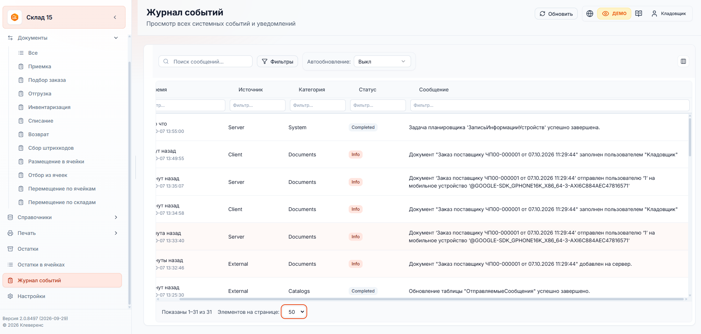

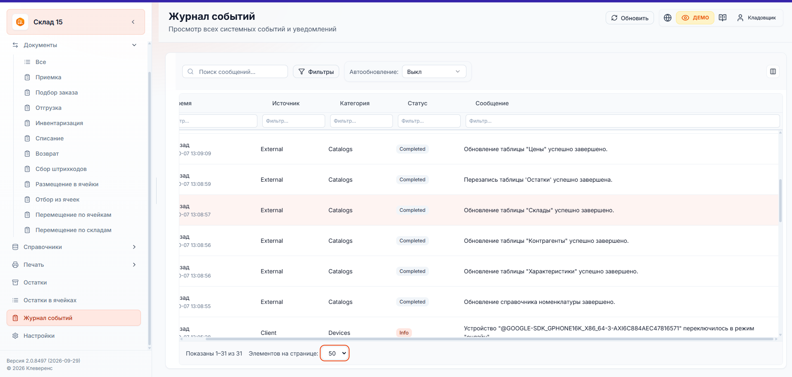

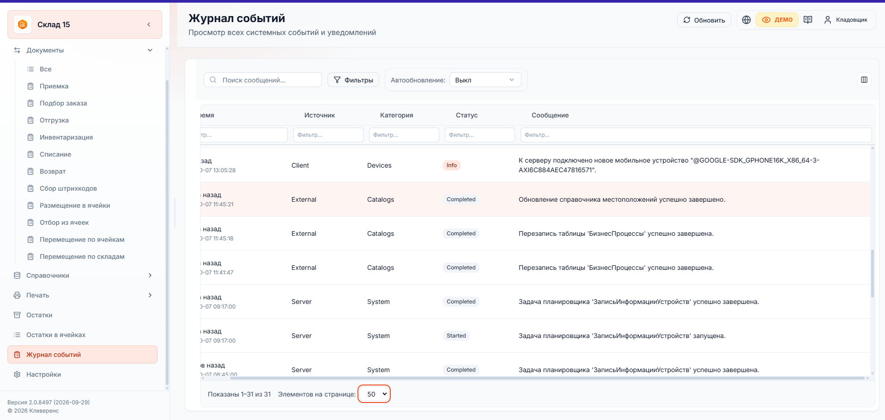
